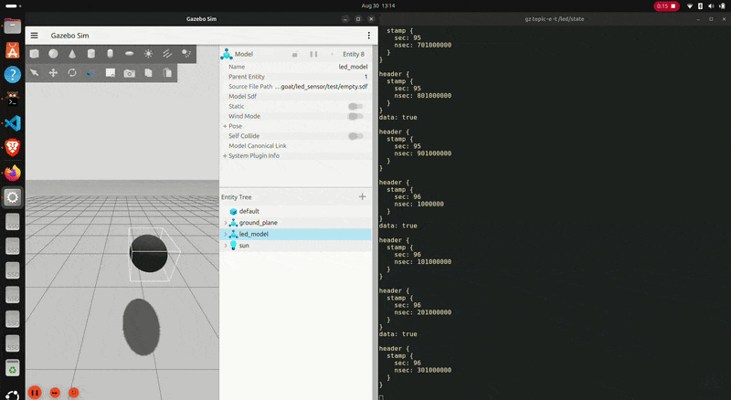

# LED Sensor Plugin

A minimal Gazebo Harmonic plugin for a simple LED sensor.

## Overview

This project builds a shared library using CMake and the Gazebo plugin stack. The source is in `src/` and the public declarations are in `include/`.

### Demo


## Build

```bash
mkdir -p build
cd build
cmake ..
make
```

## Usage

After building, load the generated shared library from the build directory in your Gazebo world or plugin setup.


## Project structure

- `src/` — implementation
- `include/` — public headers
- `assets/` — media and demo assets
- `test/` — test assets
